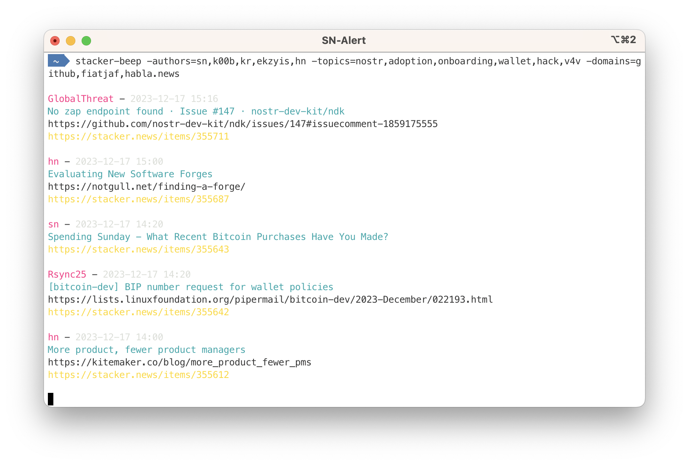

# Stacker Beep

Use this command line utility to be informed, with a *beep*, about new content of Stacker.news, filtering by authors, topics, domains and territory.



## Nostr notification

Nostr notifications via DM are available using the *-nostr-from* and *-nostr-to* options. This is useful to run Stacker Beep in headless mode, either remotely or in the local PC with a background process, to route notifications to the preferred Nostr client.

For `-nostr-from` use a random key, **not** your private key. A static key, versus random generated ones, is useful to have all the notifications in a single conversation, so avoid spamming your inbox.

## Usage examples

```
sn-alert -authors=sn,k00b,kr,ekzyis,hn -topics=nostr,adoption,onboarding,wallet,hack -domains=github,lopp
```

```
stacker-beep -topics=channel,fee,node -territory=bitcoin
```

```
stacker-beep -topics=nip-99,gossip,coracle,njump \
-nostr-from=3038ada4c724b5d7135cd0acbc2fb59842573a0d7e18c6a5706655a54bd82d5e \
-nostr-to=7bdef7be22dd8e59f4600e044aa53a1cf975a9dc7d27df5833bc77db784a5805
-nostr-relays=wss://nostr.wine
```

Run `stacker-beep -help` for more options.